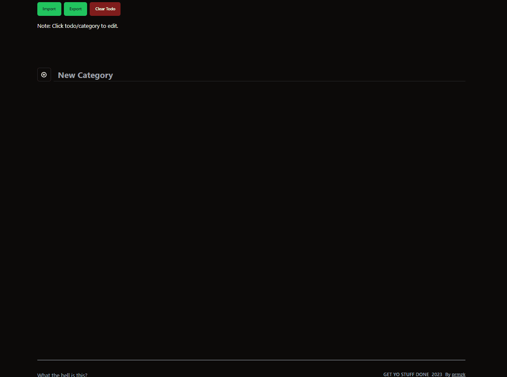

# GET YO STUFF DONE

A simple To Do app that are locally saved. Tired of all freemium complex to do app.

App deployed [here](https://get-yo-stuff-done.vercel.app/)

## Data

Data are locally saved in `localStorage` of your browser. No server or API calls or anything.

Manually sync the data by exporting and importing the JSON.

## Running the app

1. Install dependencines `yarn install`
2. Run the app in dev mode `yarn dev`

Additional:

- Replace `plugin:@typescript-eslint/recommended` to `plugin:@typescript-eslint/recommended-type-checked` or `plugin:@typescript-eslint/strict-type-checked`
- Optionally add `plugin:@typescript-eslint/stylistic-type-checked`
- Install [eslint-plugin-react](https://github.com/jsx-eslint/eslint-plugin-react) and add `plugin:react/recommended` & `plugin:react/jsx-runtime` to the `extends` list

## Tech Used

- ⚡ Vite
- ⚛ React 18
- ⛽ TypeScript
- 💻 Vercel
- 🎨 TailwindCSS
- 📚 shadcn/ui
